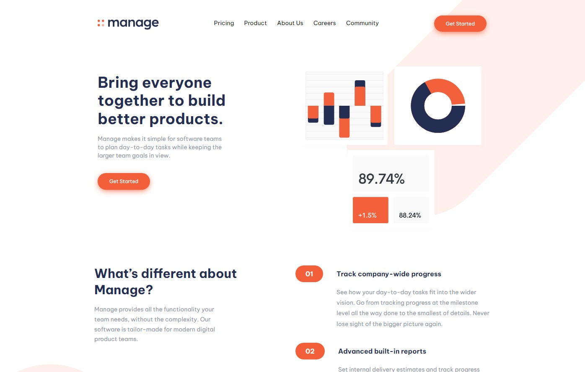

# Frontend Mentor - Manage landing page solution

This is my solution to the [Manage landing page challenge on Frontend Mentor](https://www.frontendmentor.io/challenges/manage-landing-page-SLXqC6P5).

## Table of contents

- [Overview](#overview)
  - [The challenge](#the-challenge)
  - [Screenshot](#screenshot)
  - [Links](#links)
- [My process](#my-process)
  - [Built with](#built-with)
  - [What I learned](#what-i-learned)
  - [Continued development](#continued-development)
  - [Useful resources](#useful-resources)
- [Author](#author)

## Overview

### The challenge

Users should be able to:

- View the optimal layout for the site depending on their device's screen size
- See hover states for all interactive elements on the page
- See all testimonials in a horizontal slider
- Receive an error message when the newsletter sign up `form` is submitted if:
  - The `input` field is empty
  - The email address is not formatted correctly

### Screenshot



### Links

- Solution URL: [https://github.com/daHatta/fem-manage-landing-page](https://github.com/daHatta/fem-manage-landing-page)
- Live Site URL: [Add live site URL here](https://your-live-site-url.com)

## My process

### Built with

- Semantic HTML5 markup
- CSS custom properties
- Flexbox
- CSS Grid
- Mobile-first workflow
- [Tailwind CSS](https://tailwindcss.com/) - CSS framework
- [Next.js](https://nextjs.org/) - React framework
- [Styled Components](https://styled-components.com/) - For styles

Packages:

```js
// ...
"dependencies": {
  "@hookform/resolvers": "^3.3.4",
  "next": "14.1.3",
  "react": "^18",
  "react-dom": "^18",
  "react-hook-form": "^7.51.0",
  "swiper": "^11.0.7",
  "zod": "^3.22.4"
},
//...
```

### What I learned

This was the biggest challenge for now which I solved by using next.js and tailwind css.

I also used plain CSS in several occasions.

In order to prevent doubling code, I used grid with named areas for the footer:

```css
/* ... */
#footer > div {
  grid-template-areas:
    "newsletter"
    "navi"
    "social"
    "logo"
    "copyright";
  grid-template-rows: 5fr;
  grid-template-columns: 1fr;
}
/* ... */
#footer > div {
  grid-template-areas:
    "logo navi newsletter"
    "social navi copyright";
  grid-template-rows: 2fr;
  grid-template-columns: min-content auto min-content;
}
/* ... */
```

I also used the !important property in order to customize the appearance of the swiper carousel:

```css
/* ... */
.swiper-horizontal > .swiper-pagination {
  bottom: 0 !important;
}

.swiper-pagination-bullet {
  background: var(--veryLightGray) !important;
  border: 1px solid var(--brightRed) !important;
  opacity: 1 !important;
}

.swiper-pagination-bullet-active {
  background-color: var(--brightRed) !important;
}
/* ... */
```

I received the biggest learning curve on the next.js side:

1. Implementing the form validation for the newsletter feature.
2. Implementing a overlay for the mobile menu.
3. Implementing a swiper carousel in react was new to me.

### Continued development

Was a great challenges with some advanced topics like form validation and responsive sliders which where a bit harder to solve for me in Nextjs than in plain JavaScript.
To improve my nextjs skills I will definitivly look out for further challenges which I look forward to solve with the techniques used in this challenge.

### Useful resources

- [Tailwind Crash Course | Project From Scratch](https://www.youtube.com/watch?v=dFgzHOX84xQ) - Great tutorial by **Brad Traversy** from _Traversy Media_.
- [Build a responsive website with HTML & CSS | Part one: Analyzing the project and setting the stage](https://www.youtube.com/watch?v=h3bTwCqX4ns) - Great video series by **Kevin Powell** dealing with this challenge.
- [Tailwind CSS Cheat Sheet](https://tailwindcomponents.com/cheatsheet/) - Tailwind CSS cheat sheet by _tailwindcomponents_.
- [React Hook Form (+ Zod & TypeScript & Server Errors) - COMPLETE Tutorial](https://www.youtube.com/watch?v=u6PQ5xZAv7Q) - Awesome tutorial by **Wesley** aka _ByteGrad_.
- [Zod](https://zod.dev/) - TypeScript-first schema validation with static type inference.
- [Swiper React Components](https://swiperjs.com/react) - Swiper for carousels in React.
- [SwiperJS. React swiper js. How to use react-swiperjs and create a carousel (with source code) 2023](https://www.youtube.com/watch?v=KL_yIf5uiJo) - Nice tutorial for implementation of SwiperJS by **Makysm Rudnyi** of _Travels Code_.
- [Image Gallery in NextJs Using SwiperJs](https://www.youtube.com/watch?v=imhdh4xCh7I) - Another great tutorial by **Hamed Bahram**.
- [Create a Modal/Overlay using React.js and CSS](https://www.youtube.com/watch?v=D9OJX6sSyYk) - Nice tutorial by **The Opinionated Dev** about the implementation of an overlay.

## Author

- Frontend Mentor - [@daHatta](https://www.frontendmentor.io/profile/daHatta)
